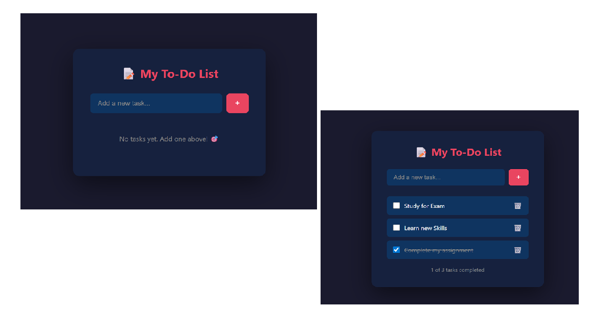

# 📝 To-Do List Web App

A responsive task management web app built with pure HTML, CSS, and JavaScript.

## 📸 Screenshot

## ✨ Features
- Add new tasks by typing and pressing Enter or clicking +
- Mark tasks as completed with a checkbox
- Delete tasks with the trash button
- Live task completion counter

## 🛠️ Tech Stack
- HTML
- CSS
- JavaScript

## 🚀 How to Run
1. Clone the repository
2. Open `index.html` in any browser
3. Start adding tasks!

## 👨‍💻 Author
**Zayeem Ajaj Sayyed**  
BBA (Computer Applications) — Foresight College, Pune  
[GitHub](https://github.com/ZayeemSayyed)
